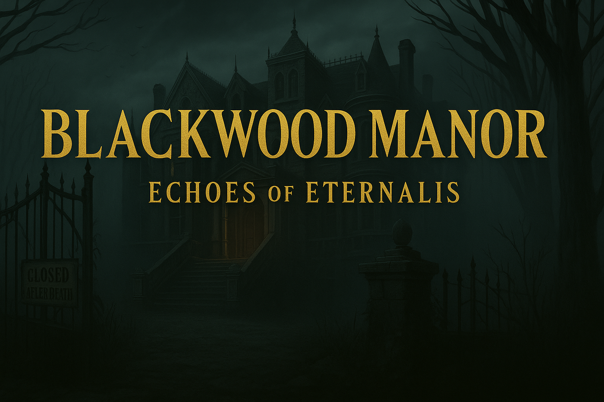

# 🏚️ Blackwood Manor - 2 Player Escape Room Adventure



A thrilling web-based escape room game where two players collaborate as detectives to uncover the dark secrets of Blackwood Manor and solve the mystery of Alistair Blackwood's disappearance.

## 🎮 Game Overview

**Blackwood Manor** is a cooperative multiplayer escape room experience that requires two players working together in real-time. Each player takes on a different detective role (Detective A and Detective B) and explores different rooms of the mysterious manor, solving puzzles and sharing clues through an integrated chat system.

### 🎯 Objective
- Uncover the secret of the Eternalis formula
- Solve interconnected puzzles across multiple rooms
- Find Alistair Blackwood and discover what happened to him
- Work together to escape the manor before it's too late

## 🌟 Features

- **Real-time Multiplayer**: Two players can join the same game session using room codes
- **Interactive Puzzles**: Multiple types of riddles and challenges
- **Immersive Storytelling**: Rich narrative with atmospheric graphics and audio
- **Progressive Gameplay**: Unlock new rooms as you solve puzzles
- **Chat System**: Built-in communication between players
- **Atmospheric Audio**: Background music and sound effects
- **Multiple Room Types**: Study, Laboratory, Security Room, Hidden Library, and Ballroom

## 🚀 Quick Start

### Prerequisites
- Modern web browser (Chrome, Firefox, Safari, Edge)
- Internet connection (for Firebase backend)
- Two players with separate devices/browsers

### Running the Game

1. **Clone the repository**
   ```bash
   git clone https://github.com/Desiam321/Escape_Room.git
   cd Escape_Room
   ```

2. **Open the game**
   - Simply open `index.html` in your web browser, or
   - Use a local server (recommended):
     ```bash
     # Python 3
     python -m http.server 8000
     
     # Python 2
     python -m SimpleHTTPServer 8000
     
     # Node.js (if you have http-server installed)
     npx http-server
     ```

3. **Start Playing**
   - Player 1: Click "Create Game" and share the room code
   - Player 2: Click "Join Game" and enter the room code
   - Both players wait for the intro video, then begin solving puzzles!

## 🎲 How to Play

### Game Setup
1. **Player 1 (Detective A)** creates a new game room
2. **Player 2 (Detective B)** joins using the 4-character room code
3. Both players watch the introduction video
4. The game begins with each player in their starting room

### Gameplay Mechanics
- **Click on objects** in the room to examine them and trigger puzzles
- **Solve riddles** to progress through the manor
- **Use the chat** to communicate with your partner
- **Share information** - some puzzles require answers from your partner's room
- **Progress together** - both players must complete their current room to advance

### Room Progression
**Detective A Path:**
1. Study Room → Hidden Library → Ballroom (Part 1)

**Detective B Path:**
1. Laboratory → Security Room → Ballroom (Part 2)

### Puzzle Types
- **Logic Puzzles**: Deductive reasoning challenges
- **Code Breaking**: Decrypt hidden messages
- **Pattern Recognition**: Visual and numerical patterns
- **Historical References**: Knowledge-based questions
- **Collaborative Puzzles**: Require information from both players

## 🏗️ Project Structure

```
Escape_Room/
├── index.html                 # Main game file
├── README.md                 # This file
├── graphics/                 # Game assets and images
│   ├── click.mp3
│   ├── success.mp3
│   ├── island_beach.png
│   ├── parchment_map.png
│   ├── ship_deck..png
│   └── KI-Prompt*/          # AI-generated room backgrounds
├── src/
│   ├── __init__.py
│   ├── StartCode.py         # Python server alternative
│   ├── static/
│   │   ├── audios/          # Background music and sound effects
│   │   ├── css/             # Stylesheets
│   │   ├── images/          # Game images and backgrounds
│   │   ├── js/
│   │   │   └── game.js      # Main game logic
│   │   └── videos/          # Intro and outro videos
│   └── templates/           # HTML templates
│       ├── escape.html
│       ├── escape2.html
│       ├── Laboratory.html
│       └── menu.html
├── outline/                 # Game design documents
└── storyline/              # Story and narrative files
```

## 🔧 Technical Details

### Technologies Used
- **Frontend**: HTML5, CSS3, JavaScript (ES6+)
- **Backend**: Firebase Firestore (real-time database)
- **Animation**: GSAP (GreenSock Animation Platform)
- **Audio**: Web Audio API
- **Styling**: Custom CSS with Google Fonts (Cinzel)

### Key Components

#### Firebase Configuration
```javascript
const firebaseConfig = {
    apiKey: "[YOUR_API_KEY]",
    authDomain: "blackwoodmanor-1cde9.firebaseapp.com",
    projectId: "blackwoodmanor-1cde9",
    storageBucket: "blackwoodmanor-1cde9.appspot.com",
    messagingSenderId: "451127821398",
    appId: "1:451127821398:web:33566d0af016124e96a7f7",
    measurementId: "G-DSSF70V9J8"
};
```

#### Game State Management
- Real-time synchronization between players
- Puzzle progress tracking
- Room transition management
- Chat message handling

## 🎨 Assets and Media

### Graphics
- **AI-Generated Backgrounds**: Atmospheric room illustrations created with AI
- **Custom UI Elements**: Buttons, modals, and interface components
- **Thematic Images**: Manor-themed visual elements

### Audio
- **Background Music**: Atmospheric horror soundtrack
- **Sound Effects**: Click sounds, success notifications
- **Volume Controls**: Adjustable audio with mute functionality

### Videos
- **Intro Video**: Sets the scene and story
- **Transition Effects**: Smooth room changes
- **Finale Video**: Dramatic conclusion

## 🔒 Security Considerations

⚠️ **Important Security Notice**: The current version contains exposed API keys in the source code. For production deployment:

1. **Rotate all API keys immediately**
2. **Use environment variables** for sensitive configuration
3. **Implement proper Firebase Security Rules**
4. **Remove credentials from version control**

### Recommended Security Updates
```javascript
// Use environment variables instead of hardcoded keys
const firebaseConfig = {
    apiKey: process.env.FIREBASE_API_KEY,
    authDomain: process.env.FIREBASE_AUTH_DOMAIN,
    // ... other config
};
```

## 🎯 Game Solutions (Spoiler Alert!)

<details>
<summary>Click to reveal puzzle solutions</summary>

### Detective A - Study Room
- **Portrait**: 3 (clock hands)
- **Typewriter**: 7 (sum of QWERTY row numbers)
- **Cabinet**: korean (1950 Korean War)

### Detective A - Hidden Library  
- **Candle**: match
- **Bookshelf**: Complex logic puzzle (alchemy-anatomy-astrology, red-green-black, greek-arabic-latin)
- **Chest**: 25 (XII + IV + IX = 12 + 4 + 9)

### Detective B - Laboratory
- **Chalkboard**: eclipse
- **Blood Stained Table**: gold (Au)
- **Hidden Formula**: 6 (NaCl atoms × H₂O atoms)

### Detective B - Security Room
- **Safe**: 37 (combine portrait + typewriter answers)
- **Monitor**: 36 (LCM of 4, 6, 9 minutes)
- **Security Door**: password

### Ballrooms
- **Detective A**: 78 (curtain numbers), 19 (chandelier lights)
- **Detective B**: mirror, 42 (Morse code in background music)

</details>

## 🚀 Development and Customization

### Adding New Puzzles
1. Add puzzle data to `gameState.riddleState` in `game.js`
2. Create corresponding HTML elements with `data-object` attributes
3. Update the riddle handling logic in `handleRiddleClick()`

### Customizing Rooms
1. Replace background images in the `graphics/` directory
2. Update CSS selectors for new room layouts
3. Modify transition logic in the game state management

### Extending Multiplayer Features
- Add more player slots
- Implement spectator mode
- Add voice chat integration

## 🐛 Troubleshooting

### Common Issues

**Players can't connect:**
- Check internet connection
- Verify Firebase configuration
- Ensure both players use the exact same room code

**Audio not playing:**
- Check browser audio permissions
- Try refreshing the page
- Verify audio files are accessible

**Game state synchronization issues:**
- Refresh both browser windows
- Check Firebase console for connection status
- Clear browser cache

**Performance issues:**
- Use a modern browser
- Close unnecessary browser tabs
- Check internet connection speed

## 🤝 Development Guidelines

We welcome contributions! Please follow these steps:

1. Fork the repository
2. Create a feature branch (`git checkout -b feature/AmazingFeature`)
3. Commit your changes (`git commit -m 'Add some AmazingFeature'`)
4. Push to the branch (`git push origin feature/AmazingFeature`)
5. Open a Pull Request


---

**Ready to enter Blackwood Manor? The mystery awaits...**

*This project was completed as a group project for the Computer Games Development coursework at TH Rosenheim*
